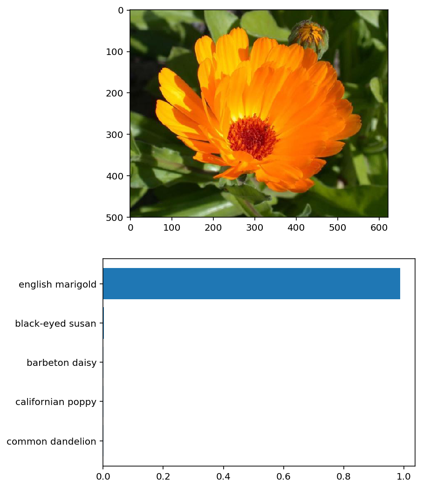

# Deep Learning
## Creating an image classifier

### Objectives

Imagine an iphone app that tells you the name of the flower your camera is looking at.   
In practice, we train an image classifier to recognize different species of flowers, then we export for use use in an application.  
Once the project completed in a jupyter notebook, we create a standalone command line application that can be trained on any set of labeled images.    
    
### Results

We use the trained model to predict [this image](flowers/valid/5/image_05209.jpg)   

Here is the result:   

    

We use `matplotlib` to plot the probabilities for the top 5 classes as a bar graph, along with the input image.   

#### Performance metrics

The Accuracy of the network on the test images is 86%   


### Model and classifier choices

To build and train a classifier, we use one of the pretrained models from `torchvision.models`: [VGG16](https://pytorch.org/docs/stable/torchvision/models.html), to get the image features. We build and train a new feed-forward classfier using those features.   

### Install

This project requires **Python 3.x** and the following Python libraries installed:

- [NumPy](http://www.numpy.org/)
- [Pandas](http://pandas.pydata.org)
- [matplotlib](http://matplotlib.org/)
- [PyTorch](https://pytorch.org/get-started/locally/)

You will also need to have software installed to run and execute an [iPython Notebook](http://ipython.org/notebook.html)

We recommend to install [Anaconda](https://www.continuum.io/downloads), a pre-packaged Python distribution that contains all of the necessary libraries and software for this project. 

### Code

The code is provided in the `image_classifier.ipynb` notebook file. The code included in `visuals.py` is meant to provide the visualizations created in the notebook.

### Run

In a terminal or command window, navigate to the top-level project directory `classify_images_with_PyTorch/` (that contains this README) and run one of the following commands:

```bash
ipython notebook image_classifier.ipynb
```  
or
```bash
jupyter notebook image_classifier.ipynb
```

This will open the iPython Notebook software and project file in your browser.

### Data

We use this [dataset](http://www.robots.ox.ac.uk/~vgg/data/flowers/102/index.html) of 102 flower categories.   


